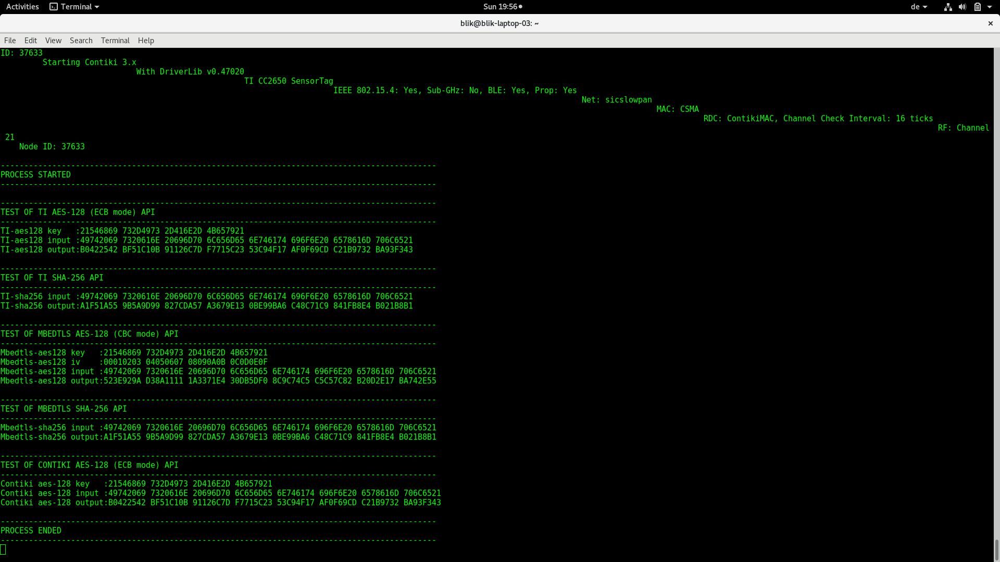

# Crypto_implementations_example
This repository provides a small educational example on how to use various cryptographic implementations in Contiki Os tested on the TI cc2650 sensortag.

The repository contains the example code under crypto_test as well as the entire contiki OS source (under contiki-os without the included contiki examples) with its supported platforms. 

## Screenshots

## Setup
1. Download and install the arm-gcc compiler. [Tutorial](http://gnuarmeclipse.github.io/toolchain/install/)
2. Add the toolchain to your path e.g. add the following line to the end of your `~/.bashrc` file `PATH=$PATH:*path to arm-gcc compiler*`
3. Install srecord (srec_cat) from [Srecord](http://srecord.sourceforge.net/)
4. If you have the TI cc2650 and want to test the code, download the TI uniflash-tool [Uniflash-tool](http://www.ti.com/tool/UNIFLASH)
4. Clone this repository `git clone https://github.com/SuperKogito/Crypto_implementations_example.git`
5. Compile the code by navigating to the 'crypto_sample.c' directory and compile the code using `make`
If the make step is successful, you will have a generated binary file called `crypto_example.bin`
6. Launch the uniflash-tool, browse to `crypto_test`, select `crypto_example.bin` and flash it to the `TI-cc2650`
7. Use `srecord` to see the output.

## crypto_example.c Documentation
Still to come

The Contiki Operating System
============================

Contiki is an open source operating system that runs on tiny low-power
microcontrollers and makes it possible to develop applications that
make efficient use of the hardware while providing standardized
low-power wireless communication for a range of hardware platforms.

Contiki is used in numerous commercial and non-commercial systems,
such as city sound monitoring, street lights, networked electrical
power meters, industrial monitoring, radiation monitoring,
construction site monitoring, alarm systems, remote house monitoring,
and so on.

For more information, see the Contiki website:
[http://contiki-os.org](http://contiki-os.org)
